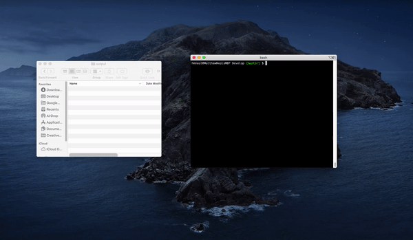

# Team Profile Generator  
  
 ## Table of Contents:  
[1. Description](#Description)  
[2. Installation](#Installation)  
[3. App Usage](#App-Usage)  
[4. License Details](#License-Details)  
[5. List of Contributors](#List-of-Contributors)  
[6. Tests](#Tests)  
[7. Questions](#Questions)  
## Description:
As a manager
## Installation:
Clone these files to your local computer from https://github.com/Matthew-Neal/Team-Profile-Generator.git
## App Usage:
Once saved trun "node app.js" and follow the prompts. This will create an html file in the output folder.
## License Details:  
 Open source licenses grant permission for anybody to use, modify, and share licensed software for any purpose, subject to conditions preserving the provenance and openness of the software. The following licenses are sorted by the number of conditions, from most (GNU AGPLv3) to none (Unlicense). Notice that the popular licenses featured on the home page (GNU GPLv3 and MIT) fall within this spectrum.   
## List of Contributors:
none
## Tests:
Functionallity Test
## Questions:
 Here is a link to my github:  
https://github.com/Matthew-Neal  
 Email me at:  
impulseimg@gmail.com  
for additional questions

#DEMO
https://matthew-neal.github.io/Team-Profile-Generator/Develop/output/team.html

